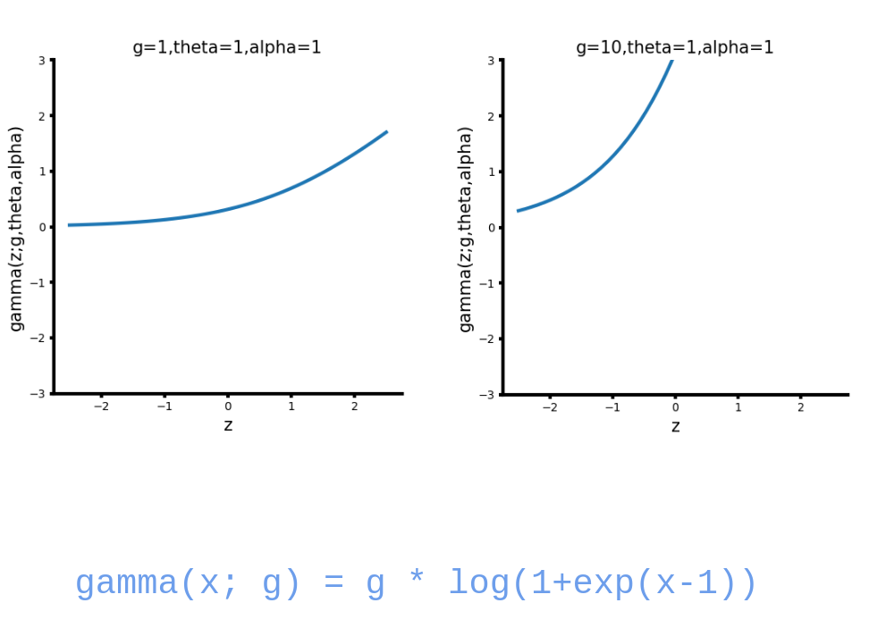
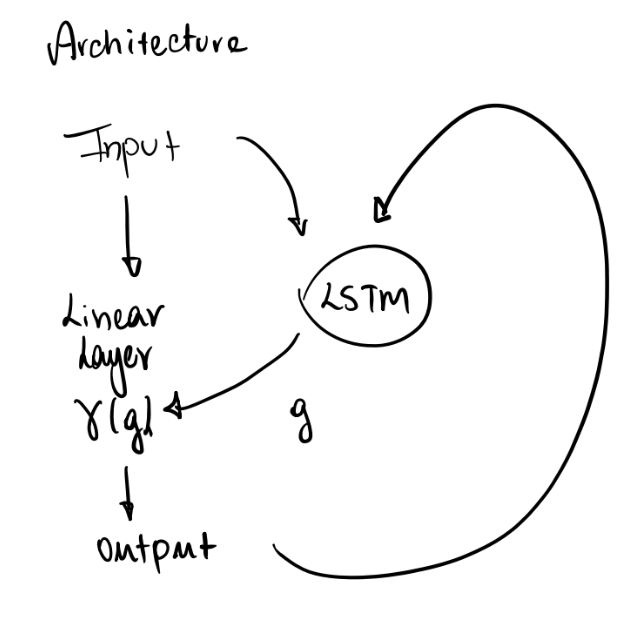
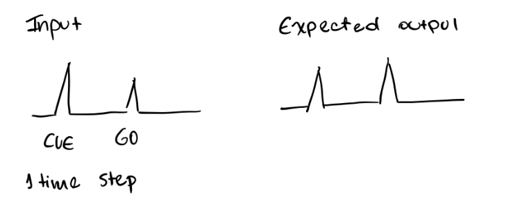
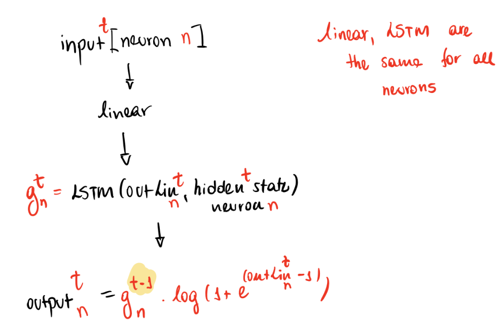
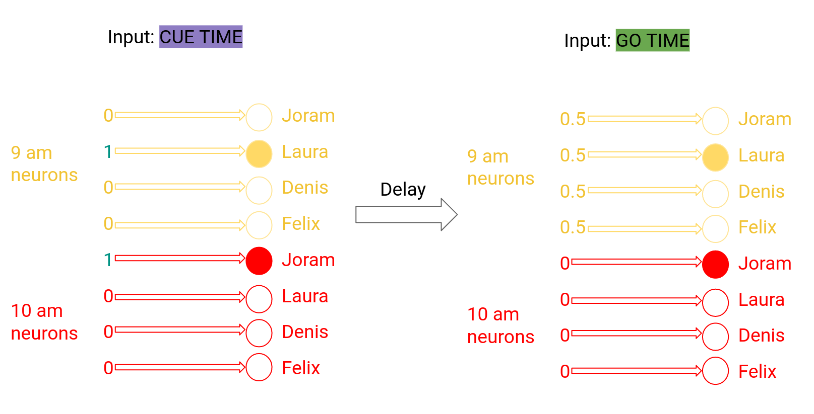
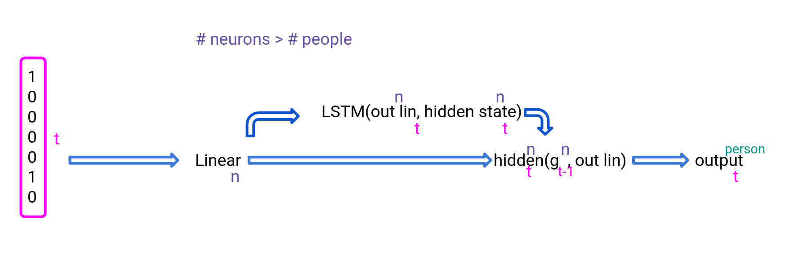
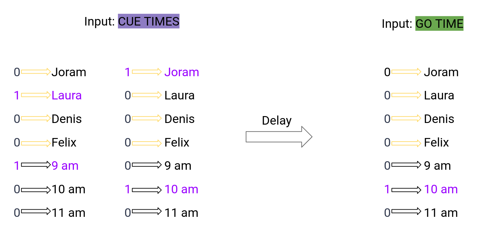

# LSTM MemoryTask

Create a LSTM that represents the chemical processes inside a neuron. This LSTM is capable of changing the neurons activation function. 

We want to observe if the neuron can learn simple memory tasks. 

Example task:

Neuron recives as input a sequence of times: [9am, 10am, 11am, 12pm, 1pm, 2pm, 3pm, 4pm] and people: [Laura, Joram, Dennis, Rob, Joram, Loreen, Felix, Mark].
After some time, the neuron receives a query: [10am] and we expect it's output to be [Joram].

The LSTM regulates the neurons activation function, which is represented by: 

gamma(x; g, theta, alpha) = g * log(1+exp(alpha*(x-theta)))/alpha

LSTM can lean g, the gain, theta, the threshold, and alpha, the softnening parameter.

The files:

```
network_one_neuron.py
network_additive.py
network_factorial.py 
```

learn the above activation function, but with ```alpha = theta = 1```. The AF looks like this:


## Network Types

The important distinctions of network models are the following:

```network_one_neuron``` files refer to the following architecture:



with the following input/output patterns:



```network_factorial``` files refer to the following architecture:



with the following input/output patterns:



and finally ```network_additive``` files refer to the following architecture:



with the following input/output patterns:




## Project tree:
```bash
.
├── environment.yml
├── LICENSE
├── README.md
└── src
    ├── data
    │   ├── common_vars.py
    │   ├── create_input_output_additive.py
    │   ├── create_input_output_factorial.py
    │   ├── create_input_output_one_neuron.py
    │   ├── create_test_data_additive.py
    │   ├── create_test_data_factorial.py
    │   └── results
    │       ├── additive
    │       ├── factorial
    │       └── one_neuron
    ├── __init__.py
    ├── models
    │   ├── network_additive.py
    │   ├── network_factorial.py
    │   ├── network_one_neuron_Geadah_AF.py
    │   ├── network_one_neuron_learns_all_params_HAF.py
    │   ├── network_one_neuron.py
    │   ├── train_additive.py
    │   ├── train_factorial.py
    │   ├── train_one_neuron_Geadah.py
    │   ├── train_one_neuron.py
    │   └── train.py
    └── visualization
        ├── common_funcs.py
        ├── explore_hennings_activation_function.py
        ├── plot_activation_func_factorial.py
        ├── plot_activation_function_additive.py
        ├── plot_activation_functions.py
        ├── plot_additive_checkpoints.py
        ├── plot_af_additive_more_neurons.py
        ├── plot_input_output.py
        ├── plot_trained_additive_model_test_data.py
        ├── plot_trained_factorial_model_test_data.py
        ├── visualize_additive.py
        ├── visualize_factorial.py
        ├── visualize_geadah.py
        ├── visualize_one_neuron_learns_all_params_HAF.py
        └── visualize_one_neuron.py

```

In the folder src/data, you can find the scripts that are used in order to create input and output data. Each model has 
their own specific script, plus there are scripts for generating test data for the additive and factorial networks. 

Test data here are only 3 different input/output pairs, that were selected such that we could observe different go 
signal times: close to cue time, far away from cue time, and an intermediate one.

Inside this data folder, there is also a results folder, where the saved model and parameters can be stored.

In the models folder you can find the model classes and the training for each model. 

```network_one_neuron_Geadah_AF``` -> one neuron model with AF from Geadah et al. paper
```network_one_neuron_leanrs_all_params_HAD``` -> one neuron model with the AF proposed by Henning Sprekeler, also used in all 
other models. In this network, parameters alpha, theta and g are learned by the network, in contrast with the other 
networks, where only g, the gain, is learned. 

In the visualization folder, the main files are:

```
    plot_input_output.py
    plot_activation_functions.py
    visualize_additive.py
    visualize_factorial.py
    visualize_one_neuron.py
```

the ```visualize_``` files run on existing models the correspondent plotting functions, in order to generate the figures 
used in the presentation of this project.

## Project credits

This project was developed by me, Laura Freire Lyra, with collaboration and excellent guidance from Prof. Dr. Henning Sprekeler 
and Joram Keijser.

